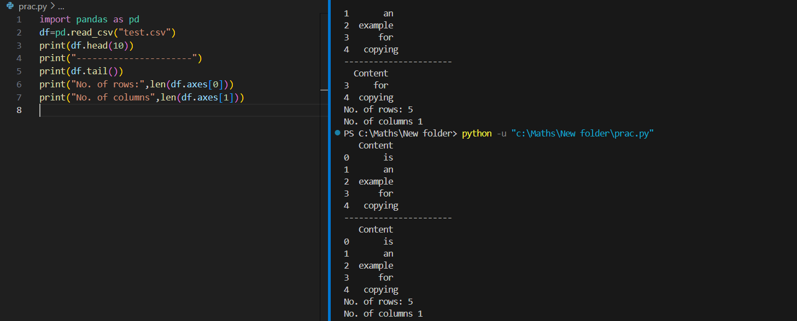

# Read-from-CSV

## AIM:
To read from a csv file using pandas
## ALGORITHM:
### Step 1:
import the pandas module

### Step 2:
Read the file using the read_csv method from pandas

### Step 3:
print the head and tail of the csv file using df.head(), df.tail()

### Step 4:
print the number of rows and columns of the csv file using df.axes[]

### Step 5:
End the program

## PROGRAM:
```
import pandas as pd
df=pd.read_csv("test.csv")
print(df.head(10))
print("----------------------")
print(df.tail())
print("No. of rows:",len(df.axes[0]))
print("No. of columns",len(df.axes[1]))
```
## OUTPUT:


## RESULT:
Thus the program to read from a csv file using pandas has been executed successfully.
